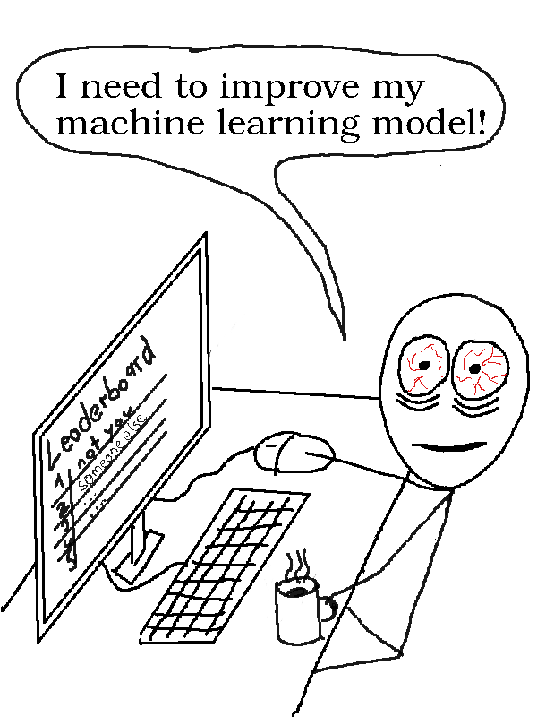

```{r setup, include=FALSE}
knitr::opts_chunk$set(echo = FALSE)
```

<!-- Story-->
A quiet night somewhere in Germany.
While everyone else sleeps, I build machine learning models and compete with other obsessed machine learners from all over the world to build the best prediction model.
Computer fans are hum to the beat of my fingers on the keyboard, only interrupted by drinking coffee.
My currently best performing model is ranked somewhere in the middle of the public leaderboard.
My machine learning model does a good job, but it's just not good enough to be among the best.
I have this great idea of how to improve some of the features with some clever feature engineering, and I also want to try boosted trees instead of random forests.
It shouldn't take more than 30 minutes.
Then I will go to bed, I promise myself.
Hours drag on before I am ready to submit another prediction and get another short to rise on the leaderboard
It's 3:30 in the morning when I'm finally ready to submit my predictions based on new features and a new model.
Full of hope, I hit the submit button.
I am so tired that I see a very blurry version of the loading screen. 
I know it tells me that my predictions are being evaluated.
Will I rise on the leaderboard?
Top 10% would be great.
There is even prices to be won for the top 3.
The actual results quickly crush my hopes and double my fatigue
My recent changes have reduced the predictive performance of my model by a lot.
I must have a bug in the code.
Should I quickly try to find it, fix it and resubmit the prediction?
My rational self finally takes control and manages to put me to bed.
I sleep restless and dream of mathematical transformations of features and constantly evolving data.

<aside>



</aside>

<!-- Personal view -->
I had a few of those late "kaggle"-evenings, but it's over now.
It's over now for two reasons.
First, I value sleep so much more now. 
More importantly for you as a reader of the bentoML blog, my understanding of what is good machine learning has changed dramatically.
My previous view was:
I have to learn all the models, how to tune them and some feature engineering.
The most important about machine learning is that the model performs really, really well.
My view now is:
Machine learning has way more moving parts than model fitting.
In some ways, model fitting is the easiest part.
Much harder and very important parts of machine learning are problem translation, getting the data right, model interpretation and understanding of the models context (more on those things later).


# It took me 5 years to go beyond model fitting 
<!-- Hard for beginners -->
It took me around 5 years to fully realize how small the role of fitting the best model is in machine learning and that there is so much more to get right.
Why so long? 
I kind of feel like an idiot for taking so long to realize that there is so much more to get machine learning right.
Let's do a post mortem of why it is so easy to think that the hardest and most important part of machine learning is the model fitting.
Let's look at how you begin to do machine learning.
You can start with a basic understanding of math and some programing skills.
You don't know about machine learning at this point.
You start taking courses at kaggle or the university, or maybe you work yourself through a textbook.
All those are focused on the training of the models, their mathematical foundations and how to program them.
You encounter some examples, but they are neatly packaged for you and don't actually have any real world application and they certainly don't have any context for you other than being part of a course.
You get some familarity with machine learning and start competing in kaggle competitions.
Again, the prediction problem you have to solve is already nicely packaged, the data is there. 
This only leaves feature engineering and, of course, finding the best model!
You might even earn money with that.
By only finding the best fitting model.
This means that machine learning really is just finding the best model, if that already potentially pays so much real money, no?
Your passion for machine learning is ignited.
You want to rank higher in the next competition!
The machine learning community is really great and open and you make use of the many blog posts about how to get better performing models and clone github repos of the latest machine learning libraries.
Because machine learning is only about the models, no?
Machine learning is such a young field, and so deeply interwoven with the research community.
To really deepen your understanding, you start reading papers on ml.
Which papers do get the most praise and echo in the community?
The ones where the models beat some benchmark of course, like Imagenet or BLEUR scores!
Have you not finally understood that it's all about the best model?
EVERYONE WANTS THE BEST MODEL. 
FITTING THE BEST MODEL IS THE MOST IMPORTANT THING YOU CAN DO TODAY!

That's actually quite close to how I learned about machine learning and I guess many share a similar path.
It's very clear to me, how easy it is for a beginner to become obsessed with the models and their performance instead of thinking about the broader context.
We as a community are to obsessed with simple performance metrics and too much in love with our models.

An anecdote from early in machine learning career:
When I first started out with machine learning applications, I wasn't such a good coder compared to my surrounding team.
But I asked good questions.
For example if the training data would match the later application data.
My mentor praised me for those questions, because not many other people asked them.
I dismissed the praise, my imposter syndrom for not knowing how to program in Scala was stronger. 
Also I thought that learning how to built stronger prediction models was more important.
Only now can I fully appreciate my mentors praise.


# What matters in machine learning

<!-- What matters -->
What does actually matter in machine learning?
We have three huge areas that are IMHO completely underestimated:

- Problem Setting. "What problem do I solve with machine learning?"
- Data-Generating Process. "Where is my data coming from?"
- Model Interpretation. "What does my model really do?"
- Application Context. "How will my model affect the real world?"

There is much more to consider and the above points are very broad.
I am glad you are here, because bentoML is a space that will give machine learning the right perspective.
A perspective beyond model optimization.
And it's easy, very easy to get fixated on that number and forget about what the data means, what the context of the appliciation is and to have insights into what the heck the model does.
As you might know, I am focusing on the second part, the model interpretation.
You can have the best performing model, but fuck one of those three topics up and your model will mean nothing or actually do harm.
Training data does not match application data? 
Management rejects model because it's a black box?
Model has severe racial bias?
But if you get data, interpretaton and context right, but only get a so-so model, you are still in a very good position, far ahead of any competition.

<!-- Big players get it wrong -->
Certainly this is only a problem of the beginners, no?
And academics who are doing research on models and ignore all the stuff around.
You just have to be smart enough, then you will automatically get machine learning right.
Well, unfortunately, no.
The best place to kind of automatically learn is - of course - doing real world projects in machine learning.
When you are just starting to learn machine learning, it can be hard to get your fingers on such a project.
But it is becoming increasingly simple, because more and more companies are doing machine learning.
But your journey doesn't end there.
You have to want to become better in the machine learning topics that have nothing to do with model optimization.
Experience alone is not enough. 
Very machine learning companies centered companies like Google or Amazon should have it figured out since a long time, if thinking about the data generating process, thinking about the impact of your model, thinking about biases and so on would come on its own if you just do enough projects.
Very recent evidence shows that this is not the case and even the big corporate players in machine learning, with all their smart personelle they are hiring for a huge amount of money, make very dumb mistakes.


Case 1: [The Google Photos app tagged people as "Gorillas".](https://www.theverge.com/2018/1/12/16882408/google-racist-gorillas-photo-recognition-algorithm-ai)
In the Google Photos app, people with darker skin had a good chance of being tagged as "Gorilla".
That was very embarassing for Google.
How can that happen?
We can't look inside Google, but speculate:
Possible first error: Bad dataset. 
My guess is that the training dataset for the image classifier didn't include many people with darker skin tones, but many gorillas.
That would mean that miss-classifying someone with darker skin as Gorilla wouldn't be a very costly mistake.
Possible error 2: Lack of diversity in the team.
As a developer, you usually test those things (at least I would), like test the app with own photos.
My guess is that this mistake would have been quickly discovered if there had been a developer or tester with darker skin early on.
Possible third error: Lack of analysing the model and thinking about possible biases.


Another example:
Case 2: [Google Flu Trends](https://en.wikipedia.org/wiki/Google_Flu_Trends)
Between 2008 and 2015, Google offered a website called "Google Flu Trends", a linear model predicting number of flu-related doctor visits in the US based on flu-related searches on Google Search.
They stopped Google Flu Trends, it worked fine in the beginning, but later over-estimated flu occurence.
One of the problems it had was that the search terms could also be related to other illnesses similar to the flu.
Also an increased attention on the flue in the news might have contributed to overestimation.
Additionally Google Flu Trend relied on seasonly correlated, non-causal search terms like "high school basketball"
Problems: Overfitting, non-causal features. And the context of the application is a very dynamic environment, because search behaviour can change any time.

I took two examples from Google (sorry Google). 
Google has lots of those stories, but there are also other candidates like amazon hiring models being biased against women or 


<!-- Why we get it wrong: A Tale of Two Horses -->

# We love simple numbers too much


One of the most frustrating parts in work can be, when we don't know if we are doing the right thing. 
Especially if you are in academia or when you don't have a boss, knowing that you are doing the most meaningful thing at the moment is impossible.
But it becomes very convenient, once you attach a number to it, because suddenly you have a proxy for "success".
This can be the number on your monthly paycheck, how often your papers are cited, how many followers you have, your ranking on the leaderboard of a machine learning competition and so on.
And to a certain degree, it's a very good thing to trying to measure your success in any way. 
But those metrics are always oversimplified and it's never possible to squeeze all relevant impact into one metric.
You might be highly paid, but you hate your job. Are you successful?
Your papers are getting cited very often, but you still have no real world impact. Are you successful?
You have thousands of followers, but nobody engages with your content. Are you successful?
You score high on the competition leaderboard, but as many other competitors, you are making use of a data leakage. Are you successful?
It is difficult to know when you should "chase" the numbers and when you should question them.
It can be daunting to absurdly increase your number of citations when you want to become a professor.
But wouldn't you rather be known for some thing you really studied in depth and for the quality, rigor and novelty in your work?
I'd argue that the citations will come with quality anyways, but if you first and only look at the metrics, you will never become a good researcher, because you got your priorities wrong.
The picture I have in mind when I think about "chasing metrics" is a racing horse.
A beautiful, strong horse that is trained to run really fast. 
At the end, when it did a good job, it gets carrots (Not sure if horses particularly like carrots, but let's pretend carrots are their favorite thing).
To fully concentrate on the target (the metric), they wear blinders, that reduce their field of vision so that they don't see what's happening left and right of them.
We are the horses, and we wear the blinders when we blindly chase the metrics.
But sometimes, if we were to look left or right, we would see a carrot field, completely without other horses. 
And we realize we have been playing the wrong game all the time.

<aside>
<div about='https://farm7.static.flickr.com/6030/6018246720_142ac4b21f.jpg'><a href='https://www.flickr.com/photos/kingstongal/6018246720/' target='_blank'></a><br/>&quot;<a href='https://www.flickr.com/photos/kingstongal/6018246720/' target='_blank'>bringing up the rear</a>&quot;&nbsp;(<a rel='license' href='https://creativecommons.org/licenses/by-nc/2.0/' target='_blank'>CC BY-NC 2.0</a>)&nbsp;by&nbsp;<a xmlns:cc='http://creativecommons.org/ns#' rel='cc:attributionURL' property='cc:attributionName' href='https://www.flickr.com/people/kingstongal/' target='_blank'>NapaneeGal</a></div>
</aside>

My big hypothesis is that we are playing the "Game of Machine Machine Learning" wrong since a long time. 
And the community is still wearing it's blinders and confusing the benchmark chase with real life.
With this blog, I hope to make a contribution towards removing those blinders and to fully embrace the complexity of machine learning, it's dependence on data, it's affect on peoples lifes, how is it is to make mistakes, how little of a role the predictive performance is in contrast.
Come with me on this journey and be part of the community that embraces the complexity of machine learning.
You can sign up here for updates from the blog.
If you are interested in writing a quest post, contact me via the contact formular.


<aside>
<div about='https://farm9.static.flickr.com/8063/8202112368_a7bf99a91c_m.jpg'><a href='https://www.flickr.com/photos/toyohara/8202112368/' target='_blank'></a><br/>&quot;<a href='https://www.flickr.com/photos/toyohara/8202112368/' target='_blank'>Bento box</a>&quot;&nbsp;(<a rel='license' href='https://creativecommons.org/licenses/by-nc/2.0/' target='_blank'>CC BY-NC 2.0</a>)&nbsp;by&nbsp;<a xmlns:cc='http://creativecommons.org/ns#' rel='cc:attributionURL' property='cc:attributionName' href='https://www.flickr.com/people/toyohara/' target='_blank'>toyohara</a></div>
</aside>

TODO: Setup Disqus.
TODO: favicon.
TODO: Thanks people on Flickr for the photos.
TODO: Setup newsletter.

