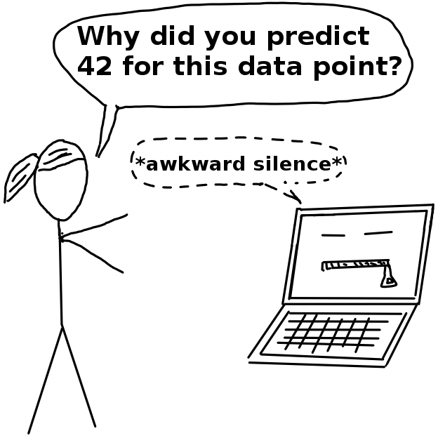

```{r setup, include=FALSE}
knitr::opts_chunk$set(echo = FALSE)
```

<!-- Story-->
A quiet night somewhere in Germany.
While everyone else sleeps, I build machine learning models and compete with other obsessed machine learners from all over the world to build the best prediction model.
Computer fans are hum to the beat of my fingers on the keyboard, only interrupted by drinking coffee.
My currently best performing model is ranked somewhere in the middle of the public leaderboard.
My machine learning model does a good job, but it's just not good enough to be among the best.
I have this great idea of how to improve some of the features with some clever feature engineering, and I also want to try boosted trees instead of random forests.
It shouldn't take more than 30 minutes.
Then I will go to bed, I promise myself.
Hours drag on before I am ready to submit another prediction and get another short to rise on the leaderboard
It's 3:30 in the morning when I'm finally ready to submit my predictions based on new features and a new model.
Full of hope, I hit the submit button.
I am so tired that I see a very blurry version of the loading screen. 
I know it tells me that my predictions are being evaluated.
Will I rise on the leaderboard?
Top 10% would be great.
There is even prices to be won for the top 3.
The actual results quickly crush my hopes and double my fatigue
My recent changes have reduced the predictive performance of my model by a lot.
I must have a bug in the code.
Should I quickly try to find it, fix it and resubmit the prediction?
My rational self finally takes control and manages to put me to bed.
I sleep restless and dream of mathematical transformations of features and constantly evolving data.


<!-- Personal view -->
I had a few of those late "kaggle"-evenings, but it's over now.
It's over now for two reasons.
First, I value sleep so much more now. 
More importantly for you as a reader of the bentoML blog, my understanding of what is good machine learning has changed dramatically.
My previous view was:
I have to learn all the models, how to tune them and some feature engineering.
The most important about machine learning is that the model performs really, really well.
My view now is:
Machine learning has way more moving parts than model fitting.
In some ways, model fitting is the easiest part.
Much harder and very important parts of machine learning are problem translation, getting the data right, model interpretation and understanding of the models context (more on those things later).


# It took me 5 years to go beyond model fitting 
<!-- Hard for beginners -->
It took me around 5 years to fully realize how small the role of fitting the best model is in machine learning and that there is so much more to get right.
Why so long? 
I kind of feel like an idiot for taking so long to realize that there is so much more to get machine learning right.
Let's do a post mortem of why it is so easy to think that the hardest and most important part of machine learning is the model fitting.
Let's look at how you begin to do machine learning.
You can start with a basic understanding of math and some programing skills.
You don't know about machine learning at this point.
You start taking courses at kaggle or the university, or maybe you work yourself through a textbook.
All those are focused on the training of the models, their mathematical foundations and how to program them.
You encounter some examples, but they are neatly packaged for you and don't actually have any real world application and they certainly don't have any context for you other than being part of a course.
You get some familarity with machine learning and start competing in kaggle competitions.
Again, the prediction problem you have to solve is already nicely packaged, the data is there. 
This only leaves feature engineering and, of course, finding the best model!
You might even earn money with that.
By only finding the best fitting model.
This means that machine learning really is just finding the best model, if that already potentially pays so much real money, no?
Your passion for machine learning is ignited.
You want to rank higher in the next competition!
The machine learning community is really great and open and you make use of the many blog posts about how to get better performing models and clone github repos of the latest machine learning libraries.
Because machine learning is only about the models, no?
Machine learning is such a young field, and so deeply interwoven with the research community.
To really deepen your understanding, you start reading papers on ml.
Which papers do get the most praise and echo in the community?
The ones where the models beat some benchmark of course, like Imagenet or BLEUR scores!
Have you not finally understood that it's all about the best model?
EVERYONE WANTS THE BEST MODEL. 
FITTING THE BEST MODEL IS THE MOST IMPORTANT THING YOU CAN DO TODAY!

That's actually quite close to how I learned about machine learning and I guess many share a similar path.
It's very clear to me, how easy it is for a beginner to become obsessed with the models and their performance instead of thinking about the broader context.
We as a community are to obsessed with simple performance metrics and too much in love with our models.

<aside>
An anecdote from early in machine learning career:
When I first started out with machine learning applications, I wasn't such a good coder compared to my surrounding team.
But I asked good questions.
For example if the training data would match the later application data.
My mentor praised me for those questions, because not many other people asked them.
I dismissed the praise, my imposter syndrom for not knowing how to program in Scala was stronger. 
Also I thought that learning how to built stronger prediction models was more important.
Only now can I fully appreciate my mentors praise.
</aside>


# What matters in machine learning

<!-- What matters -->
What does actually matter in machine learning?
We have three huge areas that are IMHO completely underestimated:

- Data-Generating Process. "Where is my data coming from?"
- Model Interpretation. "What does my model really do?"
- Application Context. "How will my model affect the real world?"

And it's easy, very easy to get fixated on that number and forget about what the data means, what the context of the appliciation is and to have insights into what the heck the model does.
As you might know, I am focusing on the second part, the model interpretation.
You can have the best performing model, but fuck one of those three topics up and your model will mean nothing or actually do harm.
Training data does not match application data? 
Management rejects model because it's a black box?
Model has severe racial bias?
But if you get data, interpretaiton and context right, but only get a so-so model, you are still in a very good position, far ahead of any competition.

<!-- Big players get it wrong -->
<!-- Why we get it wrong: A Tale of Two Horses -->


--------- TEXT MATERIAL ---------------------------------------------------------------------------------------------
<aside>
<div about='https://farm9.static.flickr.com/8063/8202112368_a7bf99a91c_m.jpg'><a href='https://www.flickr.com/photos/toyohara/8202112368/' target='_blank'></a><br/>&quot;<a href='https://www.flickr.com/photos/toyohara/8202112368/' target='_blank'>Bento box</a>&quot;&nbsp;(<a rel='license' href='https://creativecommons.org/licenses/by-nc/2.0/' target='_blank'>CC BY-NC 2.0</a>)&nbsp;by&nbsp;<a xmlns:cc='http://creativecommons.org/ns#' rel='cc:attributionURL' property='cc:attributionName' href='https://www.flickr.com/people/toyohara/' target='_blank'>toyohara</a></div>
</aside>


<!-- many are still like that -->

The first time you realize that the model fitting itself is the easist part of your work is when you work on a real-world machine learning task. 
Suddenly you are confronted with questions that you never encountered before:

- How can we formulate a problem as a prediction model so that a machine learning algorithm can solve it?
- What data should I use? Will training data and the "live" application data be similar enough? Is there some bias?
- What did my model learn? Do I trust it enough to deploy it in production?
- How will my model affect its users?


<aside>
```{r}

```
</aside>

* And no, kaggle competitions do not count as fully-blown real-world machine learning task. 
Much is happening in the background: 
Choosing a problem. 
Translate it into an ML problem. 
Find the right data. 


And these things are often problem-specific, but most importantly they are hard, very hard.
So hard that even the creme de la creme of clever people at big corporations like Google, Amazon and Microsoft, made pretty dumb mistakes.
TODO: 
Link Google Gorilla fail
Link Amazon Hiring fail
Link Tay fail

My kaggle time is a while back now, and my narrow view on what is part of machine learning has expanded a lot.

To be fair to kaggle, they have expanded a lot into this direction with kernels and data set. 
<!-- Why is it such a problem? -->


<!-- The Solution -->


## Machine Learning is a Bento Box

This - kind of addictive - model training (loss minimization) is like Sashimi, a kind of Sushi. 
Sashimi is a Japanese dish, which consists of raw fish and raw fish only.
Pure, (literally) raw, simple and perfect.
(If you don't like raw fish, insert some food you like a lot.)
Machine learning is like Sushi, or rather Sashimi.
It's very tasty.

<aside>
<div about='https://farm6.static.flickr.com/5609/15346295977_67b3f7da58_m.jpg'><a href='https://www.flickr.com/photos/phonakins/15346295977/' target='_blank'></a><br/>&quot;<a href='https://www.flickr.com/photos/phonakins/15346295977/' target='_blank'>salmon sashimi</a>&quot;&nbsp;(<a rel='license' href='https://creativecommons.org/licenses/by-nc-nd/2.0/' target='_blank'>CC BY-NC-ND 2.0</a>)&nbsp;by&nbsp;<a xmlns:cc='http://creativecommons.org/ns#' rel='cc:attributionURL' property='cc:attributionName' href='https://www.flickr.com/people/phonakins/' target='_blank'>phonakins</a></div>
</aside>

It’s easy to get the impression that machine learning consists of finding the best machine learning model. Especially if you take part in competitions. 
You can’t have Sashimi all the time, but for a healthy diet you have to add a variety of foods. 
The same is true for machine learning projects. Machine learning models optimization is just one part of it. 
The model has a context, lots of context actually. 
It comes from data, affects decisions, influences human behaviour, has unintended consequences, is embedded in a product or process.


In real life, machine learning  projects need a lot more ingredients to be successful:

- Finding a meaningful optimization goal in the first place.
- Good, unbiased, goal-relevant data
- Model interpretation.
- Ethical considerations.
- The context of the application.
- The people it affects.

- Considering the data generating process (biases, anyone?)
- Considering the context and possible second-order effects
- Actually looking into the black box model

Moving again to Japanese food (yummy!), machine learning should be better thought of as a bento box. 
A bento box is a box with many compartments with a variety of foods. 
The machine learning model is just one part of those ingredients.
I want to use the bentoML blog as a platform to speak about those machine learning topics that go beyond model fitting.
This means expect to learn about interpretability of machine learning models, how to think about your training data and to better put the model into it's context.

<aside>
<div about='https://farm9.static.flickr.com/8063/8202112368_a7bf99a91c_m.jpg'><a href='https://www.flickr.com/photos/toyohara/8202112368/' target='_blank'></a><br/>&quot;<a href='https://www.flickr.com/photos/toyohara/8202112368/' target='_blank'>Bento box</a>&quot;&nbsp;(<a rel='license' href='https://creativecommons.org/licenses/by-nc/2.0/' target='_blank'>CC BY-NC 2.0</a>)&nbsp;by&nbsp;<a xmlns:cc='http://creativecommons.org/ns#' rel='cc:attributionURL' property='cc:attributionName' href='https://www.flickr.com/people/toyohara/' target='_blank'>toyohara</a></div>
</aside>


As you might, know, I am writing a book about Interpretable Machine Learning, which is another part of the bento box. 

One of the other most important parts is the data that comes into this 


TODO: Setup Disqus
TODO: favicon
TODO: Netlify
TODO: Thanks people on Flickr for the photos

