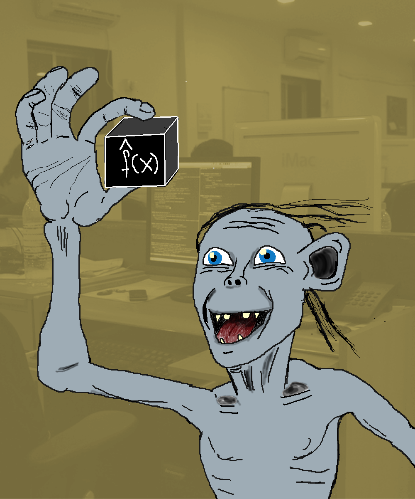

```{r setup, include=FALSE}
knitr::opts_chunk$set(echo = FALSE)
```

<!-- Story-->
*A quiet night, somewhere in Germany.
Most people were ready to go to bed.
Not me.
I had to train machine learning models.
I was competing online with obsessed people from all over the world about whose machine learning model could make the best preditions.
My computer fans were huming, dictated by the rythm of my fingers on the keyboard.
My current model was ranked somewhere in the middle of the public leaderboard.
Pathetic.
The model actually did an OK-ish job.
But OK-ish wasn't the goal of this exercise.
Outperforming everyone elses model was.
And better feature engineering and a better learning algorithm should get me there.
I had a promising idea for creating new features and using boosted trees instead of random forests.
It shouldn't take more than 30 minutes.
I promised myself to go to bed afterwards.*

*Hours passed.
It was 3:30 in the morning, when I was finally ready to submit another prediction, getting another shot at the leaderboard.
Full of hope, I hit the submit button.
I was so tired that I saw only a blurry version of the loading screen that told me that the predictions were being evaluated.
Would I rise on the leaderboard?
I dared to hope.
Could I reach the top 10%?
The actual results quickly crushed my hopes and doubled down on my fatigue.
Not only had I not risen, but my latest model performed worse than before.
A bug in the code?
Overfitting?
Did I upload the wrong prediction file?
My rational self finally took control over my body and managed to put me to bed.
I sleeped restlessly and dreamed of ever evolving decision trees that I would never comprehend.*

<aside>

</aside>


# Blinders Removed
<!-- Personal view -->
I had a few of those late-night machine learning competition sessions, but it's over now, for two reasons.
First, I value sleep so much more now. 
Second, my understanding of what is good machine learning has changed dramatically.

When I started out with machine learning, I thought the most important about machine learning is that the model performs really, really well.
And to achieve that, my sole focus would have to be on learning more learning algorithm,s feature engineering tricks and evaluation techniques that would get that damn model error down.

Today, I have a rather different view.
I think that machine learning is a lot more than loss minimization.
And in some ways, model fitting is even the easiest part, because there is a huge amount of literature, educational material and practical exercises for it.
I believe machine learning as a field, is quite mature now in fitting models.
But all around the model fitting part, we have to deal with very difficult questions, like:

- How do translate problems into prediction tasks?
- How do we create trust into the prediction models?
- Is the training data biased? Will it be similar to the application data?
- How do I debug a machine learning models if something goes wrong?
- How do (wrong) predictions affect users / the product?
- Are there harmful feedback loops between predictions and future training data?
- How will a static model perform in a dynamic environment?

My hypothesis is that the machine learning community is, on average, still focused too much on the game of model optimization.
But the community is waking up and realizing that there is much more to it.
Topics like interpretability, fairness, social impact, the role of the data are gaining more attention and importance.

# The Allure of the Model

*An anecdote from my early machine learning career:
When I first started out working on machine learning applications in a startup, I wasn't such a good coder compared to my team members.
But I asked many questions, for example whether the training data would match the later application data.
My mentor praised me for those questions, because not many other people asked them.
I dismissed the praise, since my imposter syndrom for not knowing how to program in Scala was stronger. 
Also I thought that learning how to built stronger prediction models was more important.
Only now can I fully appreciate my mentors praise.*

<!-- Hard for beginners -->
It took me around 5 years to fully realize how small the role of fitting the best model is in machine learning.
Why did it take so long? 
Short answer: Machine learning education and research focuses too much on the "best" model, and trivializes the role of data, the human component and the complex interplay of the prediction model with its environment.

For the long answer, let's look through the eyes of a hypothetical newcomer to machine learning.
Her name is Anna, she is currently doing her Master studies in electrical engineering and has a solid understanding of the mathematical basics and programing skills in C and Python.
To kickstart her machine learning career, she starts with [Andrew Ng's machine learning course](https://www.coursera.org/learn/machine-learning), and reads the book [Elements of Statistical Learning](https://web.stanford.edu/~hastie/ElemStatLearn/).
Like most other educational materials, they are essentially listing one type of model after the other, with the focus on the underlying math.
No words spent on how to think about data, social impact, ethical considerations, model interpretation, application contexts and so on.
She encounters some applciation examples, but they are neatly packaged toy examples.

At some point, she start competing in [kaggle competitions](kaggle.com).
Again she finds nicely packaged prediction problems, batteries included: 
Behind the scences kaggle has already done the hard job of finding a company with data and a problem, translating a problem into a prediction task, figuring out which data can be used, possibly doing some data cleanup and merging, deciding on a performance metric, ...
For the actual machine learning competition, this leaves some feature engineering and, of course, finding the best model!
And who gets the money in the end?
Not to the team with a well performing, interpretable model.
Not to the team with a model that trains in seconds instead of days.
Not to the team with a model might that would actually have a chance to be used in production.
To the teams with the best models. 
Her believes that machine learning really is just finding the best model are getting cemented.
I mean, clearly, these are the only models that are generating the money.

Her passion for machine learning is ignited.
She wants to rank higher in the next competition!
Fortunately, the machine learning community is really great and open.
She makes use of the many blog posts about how to get better performing models and clones github repos of the latest machine learning libraries.
She has finally understood: 
Machine learning is about fitting the best model.

She realizes how young the field of machine learning is and how closely the research community and the industry are connected.
To get an edge, she wants to read papers on machine learning.
But where to start? 
Well, papers with the most citations of course!
Which papers would that be?
Well, of course the one focused [on models and frameworks.](https://www.kdnuggets.com/2018/03/top-20-deep-learning-papers-2018.html). 
^[Any application paper cites the methods and tools it uses, so naturally papers introducing widely used models or computation frameworks are cited often.]
The dangerously simplistic message throughout her journey is that to become good at machine learning, is to master the models (and a bit feature engineering).


TODO: CONTINUE ITERATION HERE

# What Matters in Machine Learning

<!-- What matters -->
What does actually matter in machine learning?
We have three huge areas that are IMHO completely underestimated:

- Problem Setting. "What problem do I solve with machine learning?"
- Data-Generating Process. "Where is my data coming from?"
- Model Interpretation. "What does my model really do?"
- Application Context. "How will my model affect the real world?"

There is much more to consider and the above points are very broad.
I am glad you are here, because bentoML is a space that will give machine learning the right perspective.
A perspective beyond model optimization.
And it's easy, very easy to get fixated on that number and forget about what the data means, what the context of the appliciation is and to have insights into what the heck the model does.
As you might know, I am focusing on the second part, the model interpretation.
You can have the best performing model, but fuck one of those three topics up and your model will mean nothing or actually do harm.
Training data does not match application data? 
Management rejects model because it's a black box?
Model has severe racial bias?
But if you get data, interpretaton and context right, but only get a so-so model, you are still in a very good position, far ahead of any competition.

<aside>
<div style='width: 250px'>

Data scientist fitting the one model to rule them all, ca. 2013, colorized.
</div>
</aside>
<!-- Some examples -->


<!-- Big players get it wrong -->
Certainly this is only a problem of the beginners, no?
And academics who are doing research on models and ignore all the stuff around.
You just have to be smart enough, then you will automatically get machine learning right.
Well, unfortunately, no.
The best place to kind of automatically learn is - of course - doing real world projects in machine learning.
When you are just starting to learn machine learning, it can be hard to get your fingers on such a project.
But it is becoming increasingly simple, because more and more companies are doing machine learning.
But your journey doesn't end there.
You have to want to become better in the machine learning topics that have nothing to do with model optimization.
Experience alone is not enough. 
Very machine learning companies centered companies like Google or Amazon should have it figured out since a long time, if thinking about the data generating process, thinking about the impact of your model, thinking about biases and so on would come on its own if you just do enough projects.
Very recent evidence shows that this is not the case and even the big corporate players in machine learning, with all their smart personelle they are hiring for a huge amount of money, make very dumb mistakes.


Case 1: [The Google Photos app tagged people as "Gorillas".](https://www.theverge.com/2018/1/12/16882408/google-racist-gorillas-photo-recognition-algorithm-ai)
In the Google Photos app, people with darker skin had a good chance of being tagged as "Gorilla".
That was very embarassing for Google.
How can that happen?
We can't look inside Google, but speculate:
Possible first error: Bad dataset. 
My guess is that the training dataset for the image classifier didn't include many people with darker skin tones, but many gorillas.
That would mean that miss-classifying someone with darker skin as Gorilla wouldn't be a very costly mistake.
Possible error 2: Lack of diversity in the team.
As a developer, you usually test those things (at least I would), like test the app with own photos.
My guess is that this mistake would have been quickly discovered if there had been a developer or tester with darker skin early on.
Possible third error: Lack of analysing the model and thinking about possible biases.


Another example:
Case 2: [Google Flu Trends](https://en.wikipedia.org/wiki/Google_Flu_Trends)
Between 2008 and 2015, Google offered a website called "Google Flu Trends", a linear model predicting number of flu-related doctor visits in the US based on flu-related searches on Google Search.
They stopped Google Flu Trends, it worked fine in the beginning, but later over-estimated flu occurence.
One of the problems it had was that the search terms could also be related to other illnesses similar to the flu.
Also an increased attention on the flue in the news might have contributed to overestimation.
Additionally Google Flu Trend relied on seasonly correlated, non-causal search terms like "high school basketball"
Problems: Overfitting, non-causal features. And the context of the application is a very dynamic environment, because search behaviour can change any time.

I took two examples from Google (sorry Google). 
Google has lots of those stories, but there are also other candidates like amazon hiring models being biased against women or 


<!-- Why we get it wrong: A Tale of Two Horses -->

# Numbers Seem to Simplify Life


One of the most frustrating parts in work can be, when we don't know if we are doing the right thing. 
Especially if you are in academia or when you don't have a boss, knowing that you are doing the most meaningful thing at the moment is impossible.
But it becomes very convenient, once you attach a number to it, because suddenly you have a proxy for "success".
This can be the number on your monthly paycheck, how often your papers are cited, how many followers you have, your ranking on the leaderboard of a machine learning competition and so on.
And to a certain degree, it's a very good thing to trying to measure your success in any way. 
But those metrics are always oversimplified and it's never possible to squeeze all relevant impact into one metric.
You might be highly paid, but you hate your job. Are you successful?
Your papers are getting cited very often, but you still have no real world impact. Are you successful?
You have thousands of followers, but nobody engages with your content. Are you successful?
You score high on the competition leaderboard, but as many other competitors, you are making use of a data leakage. Are you successful?
It is difficult to know when you should "chase" the numbers and when you should question them.
It can be daunting to absurdly increase your number of citations when you want to become a professor.
But wouldn't you rather be known for some thing you really studied in depth and for the quality, rigor and novelty in your work?
I'd argue that the citations will come with quality anyways, but if you first and only look at the metrics, you will never become a good researcher, because you got your priorities wrong.
The picture I have in mind when I think about "chasing metrics" is a racing horse.
A beautiful, strong horse that is trained to run really fast. 
At the end, when it did a good job, it gets carrots (Not sure if horses particularly like carrots, but let's pretend carrots are their favorite thing).
To fully concentrate on the target (the metric), they wear blinders, that reduce their field of vision so that they don't see what's happening left and right of them.
We are the horses, and we wear the blinders when we blindly chase the metrics.
But sometimes, if we were to look left or right, we would see a carrot field, completely without other horses. 
And we realize we have been playing the wrong game all the time.

<aside>
<div about='https://farm7.static.flickr.com/6030/6018246720_142ac4b21f.jpg'><a href='https://www.flickr.com/photos/kingstongal/6018246720/' target='_blank'></a><br/>&quot;<a href='https://www.flickr.com/photos/kingstongal/6018246720/' target='_blank'>bringing up the rear</a>&quot;&nbsp;(<a rel='license' href='https://creativecommons.org/licenses/by-nc/2.0/' target='_blank'>CC BY-NC 2.0</a>)&nbsp;by&nbsp;<a xmlns:cc='http://creativecommons.org/ns#' rel='cc:attributionURL' property='cc:attributionName' href='https://www.flickr.com/people/kingstongal/' target='_blank'>NapaneeGal</a></div>
</aside>

My big hypothesis is that we are playing the "Game of Machine Machine Learning" wrong since a long time. 
The community is still wearing it's blinders and confusing the benchmark chase with real life.
With this blog, I hope to make a contribution towards removing those blinders and to fully embrace the complexity of machine learning, it's dependence on data, it's affect on peoples lifes, how is it is to make mistakes, how little of a role the predictive performance is in contrast.
Come with me on this journey and be part of the community that embraces the complexity of machine learning.
You can sign up here for updates from the blog.
If you are interested in writing a quest post, contact me via the contact formular.


<aside>
<div about='https://farm9.static.flickr.com/8063/8202112368_a7bf99a91c_m.jpg'><a href='https://www.flickr.com/photos/toyohara/8202112368/' target='_blank'></a><br/>&quot;<a href='https://www.flickr.com/photos/toyohara/8202112368/' target='_blank'>Bento box</a>&quot;&nbsp;(<a rel='license' href='https://creativecommons.org/licenses/by-nc/2.0/' target='_blank'>CC BY-NC 2.0</a>)&nbsp;by&nbsp;<a xmlns:cc='http://creativecommons.org/ns#' rel='cc:attributionURL' property='cc:attributionName' href='https://www.flickr.com/people/toyohara/' target='_blank'>toyohara</a></div>
</aside>


It's not as bad as I painted it.
Kaggle has kernels.
The topic of machine learning beyond model fitting is becoming more common. 
See also [this post by Robert Chang](https://medium.com/@rchang/getting-better-at-machine-learning-16b4dd913a1f), which is in similar spirit as the one you are reading here.
People are starting to think about fairness. 
Checkout the in-progress book here.
There is also the young field of interpretable machine learning with a great ebook "Interpretable Machine Learning" (shameless self-promotion alert).

TODO: Setup Disqus.
TODO: favicon.
TODO: Thanks people on Flickr for the photos.
TODO: Setup newsletter.

