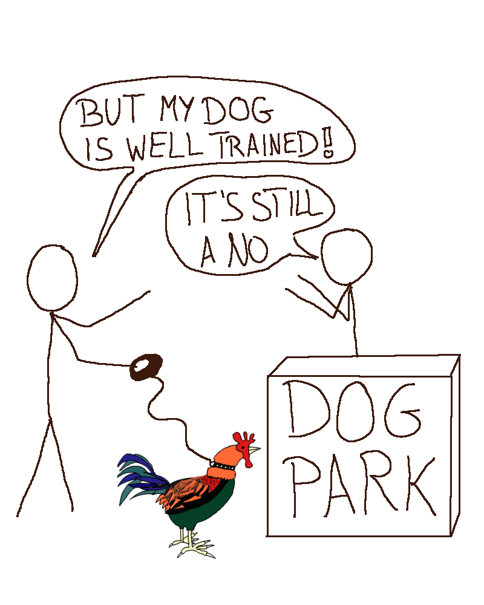
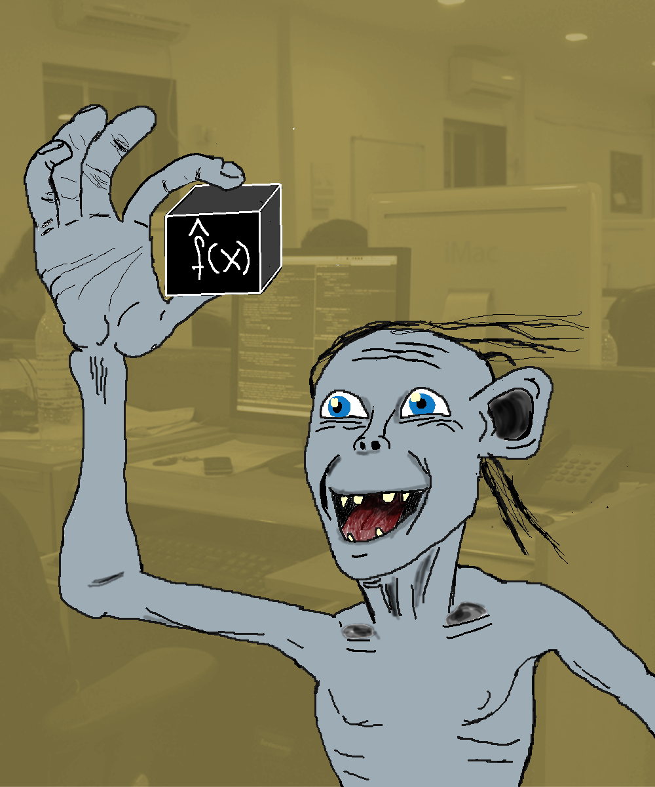

```{r setup, include=FALSE}
knitr::opts_chunk$set(echo = FALSE)
```

<!-- Story-->
*A quiet night, somewhere in Germany.
Most people were ready to go to bed.
Not me.
I had to train machine learning models.
I was competing online with obsessed people from all over the world about whose machine learning model could make the best preditions.
My computer fans were huming, dictated by the rythm of my fingers on the keyboard.
My current model was ranked somewhere in the middle of the public leaderboard.
Pathetic.
The model actually did an OK-ish job.
But OK-ish wasn't the goal of this exercise.
Outperforming everyone elses model was.
Better feature engineering and better learning algorithms should get me there.
I had a promising idea for creating new features and using boosted trees instead of random forests.
It shouldn't take more than 30 minutes.
I promised myself to go to bed afterwards.*

*Hours passed.
It was 3:30 in the morning, when I was finally ready to submit another prediction, getting another shot at the leaderboard.
Full of hope, I hit the submit button.
I was so tired that I saw only a blurry version of the loading screen that told me that the predictions were being evaluated.
Would I rise on the leaderboard?
I dared to hope.
Could I reach the top 10%?
The actual results quickly crushed my hopes and doubled my fatigue.
Not only had I not risen on the leaderboard, but my latest model performed worse than before.
A bug in the code?
Overfitting?
Did I upload the wrong prediction file?
My rational self finally took control over my body and managed to put me to bed.
I sleept restlessly and dreamt of ever evolving decision trees that I would never comprehend.*

<aside>
<div style='width: 250px'>

Working late to submit better predictions.
</div>
</aside>


# Blinders Removed
<!-- Personal view -->
I had a few of those late-night machine learning competition sessions, but it's over now, for two reasons.
First, I value sleep so much more now. 
Second, my understanding of machine learning has changed dramatically.

When I started out with machine learning, I thought the most important machine learning skill to master is to train the best model performing model.
And to achieve that, my sole focus would have to be on learning more algorithms, feature engineering tricks and evaluation techniques that would get that damn model error down.
I mean, [I literally wrote a poem about random forests](http://machine-master.blogspot.com/2014/02/) a few years ago.

Today, I have a rather different view.
I think that machine learning is a lot more than loss minimization.
And in some ways, model fitting is even the easiest part, because there is a huge amount of literature, educational material, practical exercises and excellent software for it.
And you always get instant feedback (e.g. performance on unseen test data), which is very satisfying.
I believe machine learning as a field, is quite mature now in fitting models.
But beyond model fitting, we have to deal with very difficult questions, such as:

- How do we translate problems into prediction tasks?
- How do we create trust into the prediction models?
- Is the training data biased? Will it be similar to the application data?
- How do I debug a machine learning model if something goes wrong?
- How do (wrong) predictions affect users / the product?
- Are there harmful feedback loops between predictions and future training data?
- How will a static model perform in a dynamic environment?

<aside>
<div style='width: 250px'>

Data Scientist trying to integrate their latest machine learning model into the real world.
</div>
</aside>


My hypothesis is that the machine learning community is, on average, still focused too much on the game of model optimization.
But the community is waking up and realizing that there is much more to it.
Topics like system thinking, interpretability, fairness, social impact, the role of the data and so on are getting more attention.


# The Allure of the Model

*An anecdote from my early machine learning career:
When I started to work on machine learning applications in a startup, I wasn't as good in coding (by far) as the other team members.
But I asked many questions, for example whether the training data would match the later application data.
My mentor praised me for those questions.
I dismissed the praise, since my imposter syndrom for not knowing how to program in Scala was stronger. 
Also I thought that learning how to built stronger prediction models was more important.
Only now can I fully appreciate my mentors praise.*

<!-- Hard for beginners -->
It took me around 5 years to fully realize how small the role of fitting the best model is in machine learning.
Why did it take so long? 
Short answer: Machine learning education and research focuses too much on the "best" model, and trivializes the role of data, the human component and the complex interplay of the prediction model with its environment.

For the long answer, let's look through the eyes of a hypothetical newcomer to machine learning.
Her name is Anna, she is currently doing her Master studies in electrical engineering and has a solid understanding of the mathematical basics and can program in C and Python.
To kick-start her machine learning career, she starts with [Andrew Ng's machine learning course](https://www.coursera.org/learn/machine-learning), and reads the book [Elements of Statistical Learning](https://web.stanford.edu/~hastie/ElemStatLearn/).
Like most other educational materials, they are essentially listing one type of model after the other, with the focus on the underlying math.
Almost no words spent on how to think about data, social impact, ethical considerations, model interpretation, application contexts and so on.
She encounters some application examples, but they are neatly packaged toy examples.

At some point, she start competing in [Kaggle competitions](kaggle.com).
Again she finds nicely packaged prediction problems, batteries included: 
Behind the scenes Kaggle has already done the hard job of finding a company with data and a problem, translating a problem into a prediction task, figuring out which data can be used, possibly doing some data cleanup and merging, deciding on a performance metric, ...
For the actual machine learning competition, this leaves some feature engineering and, of course, finding the best model!
And who gets the money in the end?
Not to the team with a well performing, interpretable model.
Not to the team with a model that trains in seconds instead of days.
Not to the team with a model might that would actually have a chance to be used in production.
The money goes to the teams with the highest predictive performance. 
Her believes that machine learning really is just finding the best model are getting cemented.
I mean, clearly, these are visibly the winners that get money and honor.

<aside>
<div style='width: 250px'>

Data scientist fitting the one model to rule them all, ca. 2013, colorized.
</div>
</aside>

Her passion for machine learning is ignited.
She wants to rank higher in the next competition!
Fortunately, the machine learning community is really great and open.
She makes use of the many blog posts about how to get better performing models and clones Github repos of the latest machine learning libraries.
She has finally understood: 
Machine learning is about fitting the best model.

She realizes how young the field of machine learning is and how closely the research community and the industry are connected.
To get an edge, she wants to read papers on machine learning.
But where to start? 
Well, papers with the most citations of course!
Which papers would that be?
Well, of course the one focused [on models and frameworks.](https://www.kdnuggets.com/2018/03/top-20-deep-learning-papers-2018.html). 
^[Many application papers cite the methods and tools they used, so naturally papers introducing widely used models or computation frameworks are cited often.]
The dangerously simplistic message throughout her journey is that to become good at machine learning, you have to focus on the modeling algorithms (and a bit feature engineering).


# What Matters in Machine Learning

<!-- What matters -->
If winning a Kaggle competition is not enough to become a machine learning expert, then what else is there to know?
IMHO the following topics are completely undervalued and deserve way more attention from the machine learning community.

- **Problem Formulation**: Translate a problem into a prediction or pattern recognition problem.
- **Data-Generating Process**: Understand the data, its limitations and suitability for solving the problem.
- **Model Interpretation**: Analyze the model beyond cross-validated performance estimates.
- **Application Context**: Reflect how the model will interact with the world.
- **Model Deployment**: Integrate the model into a product or process.

This list is non-exhaustive. 
Leave a comment if you think something is missing.

You can have the best performing model, but mess up one of the mentioned points and your model will be useless or even harmful.
When the training data does not match application data, the model might be completely useless.
When management rejects the model because it's a black box, you have to go back to the drawing board.
When you find out that the model has a racial bias, you better not use it.

If you get problem formulation, data, interpretation, context and deployment right, the project will be a great success, even if the model performance is only so-so, compared to some super-tuned stacked ensemble method that goes to the trash bin.

# Easy to Get it Wrong

Let me share a story where a machine learning model performed well, but achieved the opposite of what people wanted.
A friend of mine worked for a telecom company that sells, among other things, mobile contracts (telephone, sms, data).
He was in the company's data science team and he was involved in a project to predict which customers are most likely to quit their mobile contracts.
The goal was to prevent those customers from leaving by offering them better deals.
So the team went ahead and built a machine learning that worked quite well in detecting those customers.
They scored each customer and sent lists of those customers to another team that was responsible for actually contacting the customers and offering them better contracts.
And the results?
Well, the number of cancellation INCREASED instead of declined. 
Why?   
The theory was that the customers that were contacted were reminded of their mobile contracts they wanted to quit.
The email they received acted as a trigger to finally cancel their contract and go to another provider.  
What was the problem?  
It starts with how the problem was translated into a prediction problem.
The model predicted "How likely is customer X to leave?".
But it should have been "How likely is customer X to leave when we send an e-mail". 
The issue can also be seen as a problem with the application context.
There hasn't been enough reflection about the consequences when you send emails to people who are likely to quit their contract with you.
A+ for model building, F for problem formulation and context.


# You Are In Good Company

<!-- Big players get it wrong -->
Certainly, only beginners make such mistakes with machine learning for real tasks?
Well, no.
The best way to start learning machine learning beyond model fitting is by working on real world projects.
But your journey doesn't end there.
You have to WANT to become better in the machine learning topics that have nothing to do with model optimization.
Experience alone is not enough. 
Companies with a strong focus on ML like Google or Amazon should have mastered machine learning beyond optimization a long time ago.
Well, they haven't.
With all their PhDs, all their money, all their experience, all their data, all their technical expertise, they haven't figured it out yet.
Instead, they make very dumb mistakes still.
Because it's difficult to apply machine learning in the real world.

Examples of big companies failing at machine learning:

- [The Google Photos app tagged people as "Gorillas".](https://www.theverge.com/2018/1/12/16882408/google-racist-gorillas-photo-recognition-algorithm-ai).
Their solution was to not predict the tag 'Gorillas' any longer. 
That's like when you have mold on your wall and you paint it instead of fixing the underlying issue.
- [Google Flu Trends over-estimated flu occurrence](https://en.wikipedia.org/wiki/Google_Flu_Trends). 
They pulled the product. 
It worked by correlating search terms with flu occurrence, which seems to have picked up non-causal terms like "high school basketball". 
- [Amazon built a hiring tool with gender bias](https://www.reuters.com/article/us-amazon-com-jobs-automation-insight/amazon-scraps-secret-ai-recruiting-tool-that-showed-bias-against-women-idUSKCN1MK08G). 
It was trained with their own hiring data and the model simply picked up Amazons hiring bias (i.e. favoring men).
The tool was never used.
The narrative is that now it's fine, because they don't use the tool, ignoring that the underlying gender bias remains.
Again, painting a molded wall white.


<!-- Why we get it wrong: A Tale of Two Horses -->

# Simplify Your Life with Numbers!

Work is frustrating without feedback telling you whether you do the right thing and how well you do it.
Especially in academia or when you are without a boss, it's common to wonder whether you are doing the most meaningful thing at the moment.
Having a boss who tells you what to do might feel easier, but let me tell you a secret:
No one has figured it all out.
No matter how old you get, there is no sudden realization in your head how the world works.
People just do things.
Work feels more rewarding when you can measure how well you did.
A proxy of success.  

"Today I read 5 papers."  
"This week I finished a 10-pages report."  
"This month my website had 10k visitors."  
"This year I received a bonus of 20k."  

To some degree, measuring success is a great method to make work simpler and more efficient.
But those number always oversimplify success.
It's impossible to squeeze all criteria into a few numbers.

You are highly paid, but hate your job. Are you successful?  
Your papers are getting cited very often, but you still have no real world impact. Are you successful?  
You have thousands of followers, but nobody engages with your content. Are you successful?  
You score high in a machine learning competition, but like many other competitors, you are making use of a data leakage. Are you successful?  

It is difficult to know when to "chase" a number and when not to.
It is my believe that the trade-off between "chasing numbers" and doing non-measurable work (like doing research on a new product instead of selling more of the old) is heavily tipped towards chasing numbers in our society.
Also in the machine learning community.

The picture I have in mind when I think about someone "chasing numbers" is a racing horse.
A beautiful, strong horse that is trained to run really fast. 
At the end, when it did a good job, it gets carrots.
(Not sure if horses particularly like carrots, but let's pretend carrots are their favorite thing.)
To fully concentrate on the target (the number), they wear blinders that reduce their field of vision so that they don't see what's happening left and right.
We are the horses, and we wear the blinders when we blindly chase the metrics.
But sometimes, if we were to look left or right, we would see an untouched carrot field.

<div about='https://farm1.static.flickr.com/198/479610434_f2dc99ff85.jpg'><a href='https://www.flickr.com/photos/khanklatt/479610434/' target='_blank'></a><br/>&quot;<a href='https://www.flickr.com/photos/khanklatt/479610434/' target='_blank'>Horses and Grapes</a>&quot;&nbsp;(<a rel='license' href='https://creativecommons.org/licenses/by-nc/2.0/' target='_blank'>CC BY-NC 2.0</a>)&nbsp;by&nbsp;<a xmlns:cc='http://creativecommons.org/ns#' rel='cc:attributionURL' property='cc:attributionName' href='https://www.flickr.com/people/khanklatt/' target='_blank'>khanklatt</a></div>


As a community, we are playing a wrong game of machine learning since a long time. 
We have to get rid of our blinders.
With this blog, I hope to make a contribution towards removing those blinders and to help shift the focus away from model performance towards data, interpretability, application context and social impact.

