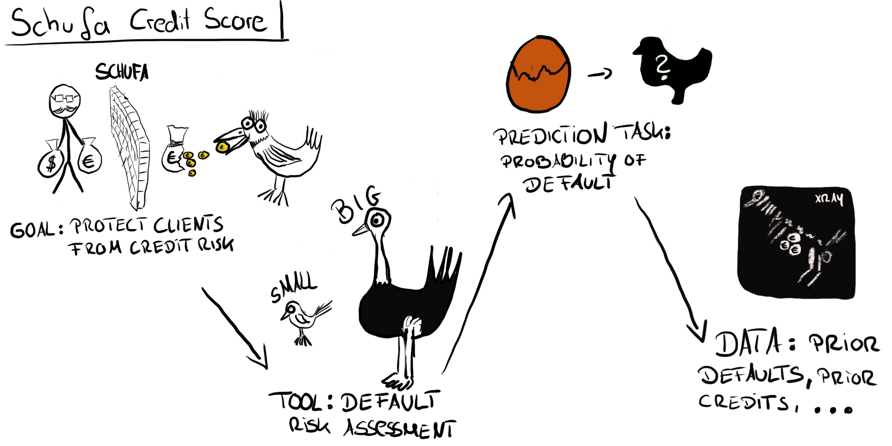

```{r setup, include=FALSE}
knitr::opts_chunk$set(echo = FALSE)
```
When we train machine learning models, we measure the loss that occurs between the true outcome and the model predictions.
We focus on minimizing the loss by trying different models, by tuning hyperparameters, by engineering the features, by transforming the data.
During this model training phase of a machine learning project, minimizing the model performance seems like the only goal and makes one forget the bigger picture.
Then we get headlines like the following, which merely focuses on the model accuracy:
"Researchers found that human dermatologists accurately identified 86.6 percent of skin cancers from a range of images, compared to 95 percent for the CNN." - [engadget 2018](https://www.engadget.com/2018/05/29/ai-outperforms-human-doctors-in-spotting-skin-cancer).
I chose this headline because it's representative of the focus on the loss minimization part and less on the systems thinking part.

Why is high predictive performance not a guarantee that a model is used in practice?
One of the reasons: machine learning learning is only good with very narrow and clearly defined tasks.
We have to translate our original goal multiple times,  narrow it down, before we can solve it with machine learning.

Let's assume our goal is to help dermatologists detect skin cancer more reliably.
We first have to decide on the tool that we want to use to solve that problem.
A special camera for the doctor that marks suspicious looking skin parts?
Or a smartphone application that the patient uses to self-examine over time, giving recommendations when to see a doctor?
An application where the patient interactively chats with a doctor and takes pictures when necessary?
The choice of the tool has a lot of impact on what data we have to collect (images with smartphones vs. images from special medical cameras), the way we formulate the prediction task (compare images over time? classify individual images?) and the cost of missclassification.

Once a tool for the goal is chosen, we have to choose a prediction task:
Do we want to predict the likelihood that some mole is cancerous?
Or that it will develop to cancer within the next year?
Is it an image recognition task or do we consider additional input from the patient?

Once we have formulated our prediction task, we have to decide which data to use.
Do we take data from one doctor's office only?
Probably not.
How many different hospitals / patients (age, sex, skin type, ...) / types of cancers / cameras and so on does the model need to generalize well in other settings?


# A simple method: Translation chain


A simple, yet powerful method is to explicitly write down the translation chain that happened from goal to data.
This helps to understand the decision, the loss or problems that might occur because of those decisions.
The translation chain happens between the following steps:

**Goal:** What do you want to achieve?

**Tool:** By which means do you want to achieve the goal?

**Prediction Task:** Which predictions or classifications are needed to make the tool work?

**Data:** Which data are used to train a model to solve the prediction task?

We start with a very broad goal and end up with very specific, detailed data.
Inevitably, we have to make simplifications and something gets lost in translation.
There ain't no such thing as a free lunch
This does not mean that we should just shrug off the fact that we have an imperfect model for our goal.
It's crucial to think about the translation chain and how it affects the applicability of the predictions to the real world.

This blog post encourages you to make those choices explicit by providing a very rough template: Goal -> Tool -> Prediction Task -> Data.

In the remainder of this post we will go through a few examples of translations: customer relationship management, predictive policing and credit scoring.

# Sending Vouchers to Customers


Imagine you manage a travel agency.
You sell trips to your customers.
The customers are mostly very loyal customers, sometimes you have new customers.
Business is not as good as it could be, so you hire a few data scientists.

**Goal:** Sell more trips

You decide that sending vouchers to your loyal customers is a good way to get them to buy more trips.

**Tool:** Send vouchers to customers.

With the translation of "sell more trip" to "send vouchers", the first loss in translation has occurred.
Maybe uninvited vouchers will annoy your customers.
Maybe your best option would be to target new, younger customers with advertisement for guided mountain tours.
But well, vouchers it is.


Sending vouchers to everyone in your database would be too expensive.
Many customers are only file corpses in your drawers anyway.
The mailings cost more than zero, because you decided that your customers will prefer good old physical paper mailings.
So, you need a way to send mailings only to promising, high-value customers.
Together with your data scientists, you work out the following prediction task:

**Prediction Task:** Predict whether a customer will book a trip within the next 2 months.

The thinking is: If people have a high likelihood to book, we want to make sure they book with us.
The voucher will be the decisive factor for a good portion of those customers.

Another loss has occurred by translating from the tool "send vouchers" to the prediction task "likelihood of booking".
Maybe the customers who are likely to book will not be affected by the voucher, because they would have booked anyways and your agency only loose money because they now book cheaper.
Maybe you should have put higher weight on customers that would book a more expensive trip.

Now that you have decided on a prediction task, the question remains which data to use.
You settle on past trips booked, demographic information, money spent on trips at your agency, time and date and so on.
Ideally, you would have access to their bank account to see if they have enough money left, to their calenders to see if they have time, to their minds so you can read their thoughts.
But you only have your agencies database, so you use that.

**Data:** Customer demographics and prior trips.

A loss might have occurred here as well.
Your data scientists might have removed customers that booked through partner programs, because you don't have access to their past booking behavior.
Maybe you should have picked 1000 customers at random, send them vouchers, observe whether they book and use this as training data.
These types of translation losses will not be visible in the model performance on the validation set.


# Predictive Policing


You are the head of the police department.
The safety of the public lies within your responsible hands.

**Goal:** Keep the city safe.

Now, how exactly do you keep the city safe?
For example by catching criminals.
Even better, prevent crimes before they happen.
One of such crime prevention measures is called "stop-and-frisk", where the police temporarily question or even search civilians. 

**Tool:** Stop-and-frisk.

A first loss has occurred:
Is this the most effective method?
Maybe the city could be made more secure by de-criminalizing drugs.
Or maybe by increasing the police staff to solve the many cases that are already on the table. 

Anyways, stop-and-frisk it is.
The police can't be everywhere at the same time, you have to prioritize time and place.
Where should you send your police men and women?
One possible answer: Send them to where you think most crime will happen.

**Prediction Task:** For given place and time, predict likelihood of a crime.

A loss occurred:
We could also include the information which crimes are easily averted by presence and which not.
Also specific crimes can be prioritized differently.
Do you treat drug consumption and burglary the same?
How exactly do you prioritize one over the other?
These trade-offs are always there, but often the choice is implicit.
The data to use for those predictions are quite obvious to you:

**Data:**: Location and time of previous crimes plus information about weather and occurrence of other events such as big sport games.

Again, a loss occurred:
We could have used completely different data sources that tell us more about the crime probabilities.
For example mobile location data or social media postings.
Or, as in the vouchers example, it might be more effective to collect data in a structured manner.
This could mean sending police at randomized times to random places and observe criminal behavior.
And then use this data to train a prediction model.
Previous crime data can be biased:
The closer you look, the more crimes you will find, leading to a self-fulfilling prophecy, which will be reflected in the database.
Also, some crimes are never reported and will not show up in the database.
Translation loss due to these problems will not be reflected in our model performance, if we evaluate it on only the previous crimes.

# Credit Scoring



How can you trust someone to give you back borrowed money?
The answer in many societies is credit scoring agencies.
In Germany the company with a quasi-Monopoly on credit information is called SCHUFA.

By the way, I visualized credit risk as birds in the above figure.
I hope that's cool with you.

**Goal:** Protect clients from credit risk.

The purpose of SCHUFA is to increase one-sided trust between two parties to allow transactions with financial risks.
For example, bank only want to give loans to people who will pay it back.
If you rent a house, you want to be assured that the tenants will be able to pay the rent.
The solution offered by credit scoring agencies is:

**Tool:** Credit worthiness scores.

A loss occurred.
Another way to increase trust between two parties is to insure credits.
Or to allow lenders to make deposits.
But a credit score it is.
Underlying the score is a prediction task:

**Prediction task:** Probability of loan default within 1 year

I am not sure whether SCHUFA uses exactly this, but let's assume for now.
Anyway, a loss occurs:
For example loan defaults that occur after one year are ignored.
You could also try to predict how much of the loan will be paid back.

From which data do we predict this?
SCHUFA does not reveal which features it uses, but they have data on current contracts of people with e.g. mobile providers, mail-order companies and so on.
And, crucially, data about credits that have not been paid.


**The Data:** Previous contracts and loans (including defaults).

Lost in translation:
People who don't get a loan in the first place, for whatever reason, never show up in the database.
Again, the perfect data situation would be to give everyone a loan and observe who can pay it back.


## Summary

A loss always occurs when you translate a goal into a very narrow machine learning model.
This post provides a simple and (hopefully) useful mental tool, the translation chain, to make those decisions more explicit.

The translation chain can also include more steps or look differently.
If you are a researcher, it might be:
Research hypothesis -> Experiment -> Model -> Interpretation Method

For example:
Introverts drink lots of coffee -> Online questionnaire -> Poisson Regression -> Interpretation of coefficients

The translation chain also works for unsupervised machine learning:

Goal -> Tool -> Unsupervised Task -> Data

Going back to the travel agency example, you might want to identify customer segments to send different voucher to the segments.

Sell trips -> Send specific vouchers -> Clustering -> Previous trips

Test it out with your machine learning project, adapt the translation chain however it suits you.


