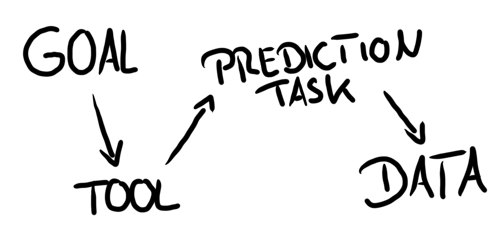

```{r setup, include=FALSE}
knitr::opts_chunk$set(echo = FALSE)
```
When we train machine learning models, we measure the loss that occurs between the true outcome and the model predictions.
We focus on minimizing the loss by trying out different models, by tuning the hyperparameters, by engineering the features, by transforming the data.
During this model training phase of an ML project, minimizing the model performance seems like the only goal and makes one forget the bigger picture.
Then we get headlines like the following, which merely focuses on the model accuracy:
"Researchers found that human dermatologists accurately identified 86.6 percent of skin cancers from a range of images, compared to 95 percent for the CNN." - [engadget 2018](https://www.engadget.com/2018/05/29/ai-outperforms-human-doctors-in-spotting-skin-cancer)

I chose this headline because it is representative of the focus on the loss minimization part and less on the systems thinking part.

Why is high predictive performance not a guarantee that a model is used in practice?
One reason: machine learning learning is only good at very narrow and clearly defined tasks.
We have to translate our original goal multiple times,  narrow it down, before we can solve it with machine learning.

Let's assume our goal is to help dermatologists detect skin cancer more easily.
We first have to decide on the tool that we want to use to solve that problem.
A special camera for the doctor that marks suspicious looking skin parts?
Or is it a smartphone application that the patient uses to self-examine over time, giving recommendations when to see a doctor?
Is it an application where the patient interactively chats with a doctor and takes pictures when necesary?
The choice of the tool has a lot of impact on what data we have to collect (images with smartphones vs. images from special medical cameras), the way we formulate the prediction task (compare images over time? classify individual images?) and the cost of missclassification.

Once a tool for the goal is chosen, we have to choose a prediction task:
Do we want to predict the likelihood that some mole is cancer?
That it will develop to cancer within the next 6 years?
Is it an image recognition task or do we consider additonal input from the patient?

Once we have formulated our prediction task, we have to decide which data to use.
Do we take data from one doctor's office only?
Probably not.
How many different hospitals/ patients (age, sex, skin color, ...) / types of cancers / cameras / ... does the model need to generalize well in other settings?


## A simple concept: Chain of translations



A simple, yet powerful method is to explicitly write down the translations that happened from goal to data.
This helps to understand the decision, the loss or problems that might occur because of those decisions.
I propose the 4 steps:

**Goal:** What's your goal?

**Tool:** By which means to you want to achieve that goal?

**Prediction Task:** What do you need to classify / predict within that tool?

**Data:** Which data are used training the machine learning model?


But before we start:
Im each translation, you have to make a decision which will always come with some compromise and there will always be some kind of loss.
We start with a very broad goal, and end up with very specific, detailed data, where we have to decide which rows and columns to keep, what to use and so on.
With each decision we inevetibly loose something from our original goal.
Something has to get lost.
There ain't no such thing as a free lunch

The most important is that you have thought about the translations that have been made and how it affects the applicability of the predictions to the real world.
My advice: Make it explicit.
This blog post will help you with a few examples how to make those steps more explicit. 
Gives you a very rough template to do it (Goal -> Tool -> Prediction Task -> Data).

In the remainder of this post we will go through a few examples how this translation steps look like with three examples: customer relationship management, predictive policing and credit scoring.

# Sending Vouchers to Customers

Imagine you manage a travel agency.
You sell trips to your customers.
The customers are mostly very loyal customers, sometimes to new customers.
At the last trade show, the stand showing how you can sell more trips using data analytics and marketing had a great impression on you and you decide to hire them.


**The Goal:** Selling more trips

The marketing consulting company advices you to send out vouchers to more customers.
With that translation of your goal to this specfic tool, the first loss in translation has occured:
Sending vouchers might not be the best tool.
Maybe uninvited vouchers will annoy your customers, maybe the low hanging fruits are a niche group of customers for whom you have the perfect trips, but they just don't know you yet.

But anyways, the decision has been made:

**The Tool:** Send vouchers to customers.


But wait!
Sending vouchers to everyone in your database would be too expensive.
Many customers are only file corpses in your drawers anyway.
The mailings cost more than zero (cause you decided that your customers will prefer good ol' physical paper mailings).
So, you need a way to send to "promising" / "high-value" customers.
We can translate this into a prediction task.
Why not predict which customer is most likely to book a trip in the next months.

**The prediction task:** Predict whether a customer will book a trip in the next 2 months.

The thinking is: If someone has a high likelihood do book, we want to make sure he books with us, and also the voucher might convince those that are not 100 percent sure whether to do a trip at all.

Another loss has occured by translating from the tool to the prediction task.
Maybe the customers who are likely to book will not be affected by the voucher, because they would have booked anyways.
You only loose money because they now book cheaper.

Now you have decided what to predict, the question is now which data to use.
You settle on past trips booked, demographic information, money spent on trips at your agency, time and date, ...
Ideally, you would have access to their bank account to see if they have enough money left, to their calenders to see if they have time, to their minds so you can read their thoughts.
But you only have your agencies database, so you use that.
Another translation has occured: From the prediction task to the data:

**The Data:** Customer demographics and prior trips.

A loss has ocurred as well.
This time you can measure it more directly, since you can measure how well the data predicts whether someone will book a trip in the next two weeks.
What's not easily measurable: The loss that ocurred by selecting a subset of the data, or by not using additional data.


# Predictive Policing

You are the head of the police department.
The executive arm of civil protection lies within your responsible hands.


**The Goal:** Keep the city safe.

Now, how exactly do you keep the city safe?
For example by catching criminals.
Even better, prevent crimes before they happen.
Also called "stop-and-frisk" in its extreme form.
So you translate the goal into:

**The Tool:** Prevent crimes by showing presence, doing stop-and-frisk.

A first loss has occurred:
Is this the most effective method?
Maybe the city could be made more secure by educating the people, by increasing the police staff to relief the burden of the many cases that are already on the table. 

Anyways, stop-and-frisk it is.
But your police staff can't be everywhere, you have to send them to specific areas.
Where to send them?
Send them to where you think most crime will happen.
This is a translation into a prediction task.

**Prediction Task:** For each place and time, predict likelihood of a crime.

A loss occurred: We could also predict who the most likely victims are or include the infromation which crimes are easily averted by presence and which not.

The data to use for those predictions is quite obvious: use spatial and time data of crimes that already ocurred in that time.
Additionally weather.

**The Data:**: Recent crimes, along with geolocation and time. Additional data: weather, occurrence of other events (e.g. soccer games).


Again, a loss occurred: We could have used completely different data sources that tell us more about the crime probabilities.
For example mobile location data or social media posting.
Also, by using the own crime data, there is a bias:
The closer the police looks, the more crimes it sees.
The other data might be dark:
Crimes that were never reported.
This loss is not reflected in our data, since we never expose our model to it, we only see the acurracy of predicting the crimes that we saw in the data.

# Credit Scoring

How can you trust someone to give you back money that you lend?
The answer in our society is credit scoring agencies.
In Germany the quasi-Monopoly is called the 'Schufa'.


**Their goal:** Protect clients from credit risk.

How do they do it?

**Their tool:** Offer credit worthiness scores to lenders.

A loss occurred: Scores are not the only tool, they could also insure the credit.
They could allow lenders to deposit something.
They could assess customers individually (which, of course, would be a lot of work).

What does the score say?

**The prediction task:** Probability of loan default within 1 year (not sure if SCHUFA uses exactly this, but let's assume for now)

Sensible goal.
Still a loss occurred: Loan defaults after one year would be ignored.
From which data do we predict this?

**The Data:** Not revealed what data the SCHUFA uses, but data they have: current contracts with e.g. mobile providers, mail-order companies, credits that have not been paid and so on.

Loss in translation: Maybe a person never paid, e.g. because of an exploitve relationship, but this relationship is over.
This is not reflected in the database.
Also not in the data base: The people who don't get a loan in the first place, for whatever reason.
Those never show up in the database.
Self-reinforcing: People with a bad score don't get a loan.


# Lost in Translation

Every machine learning project has these decision that have to be made, which ultimately narrows down the question that can be answered.


With this post, I hope I could make it more explicit how we have to narrow down our original goal to a very specific slice of data.


# From Prediction to Action

Forgot to mention so far another, very important translation.
That is the translation back.

From your model, you get back predictions.
Those predictions don't spawn into the void to the pleasure of the universe, but rather inform decision and incite actions.
How that is done is crucial for the effectiviness of the model.

Back to YouTube: You have the predictions...

But this maybe for another blog post.


