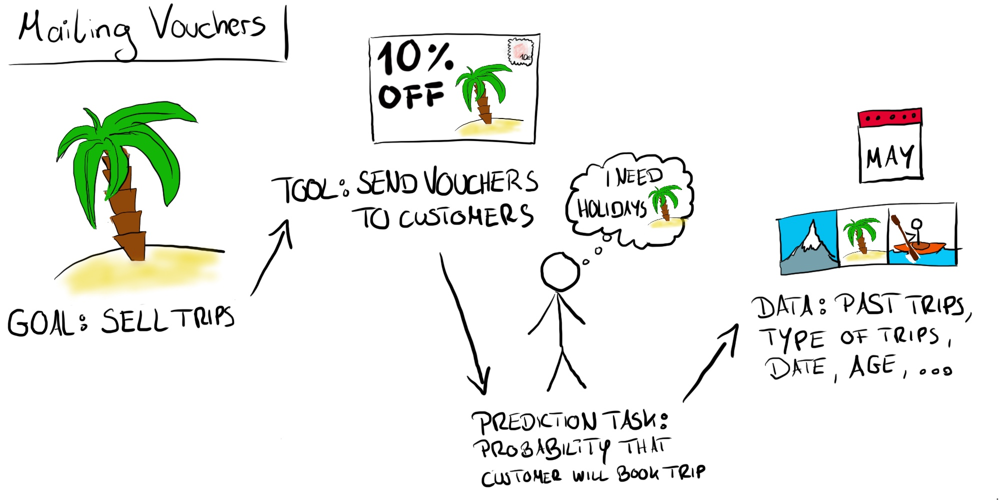
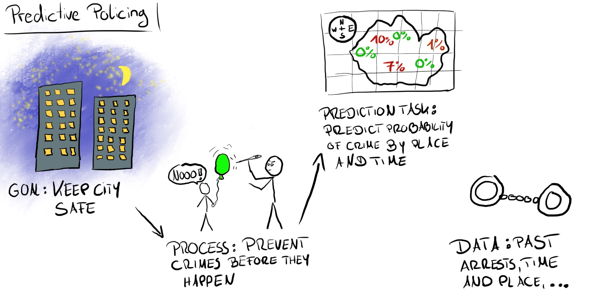
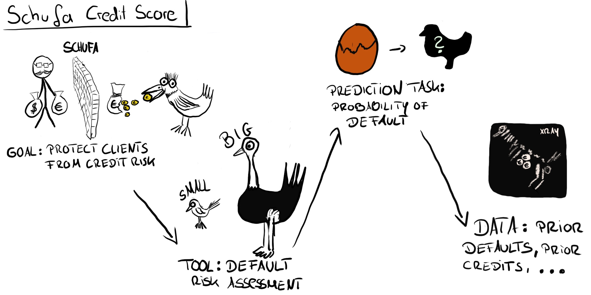

```{r setup, include=FALSE}
knitr::opts_chunk$set(echo = FALSE)
```

Predictive models solve problems.
As a data scientist, after you got the data, and do the modeling, it is easy to forget the whole pipeline that led you there, and only focus on the loss ocurring between features and target.

Loss occurs way earlier.
Because before you dive into data, you have to translate you initial goal in multiple steps until you get to the data.


First there is some goal you have as a company, individual, institution or whatever.
The goal is the thing you want to achieve overall.
This is very high level and has nothing to do with machine learning or data.
If you are YouTube, a goal might be to increase the minutes watched per day.
Another goal could be to get more content creators onto the platform.

First translations: From goal to a process or tool to achieve the goal.
When you settled on a goal, you have to decide to achieve it. 

# Sending Vouchers to Customers


# Predictive Policing


# Credit Scoring



# From Prediction to Action

Forgot to mention so far another, very important translation.
That is the translation back.

From your model, you get back predictions.
Those predictions don't spawn into the void to the pleasure of the universe, but rather inform decision and incite actions.
How that is done is crucial for the effectiviness of the model.

Back to YouTube: You have the predictions...


